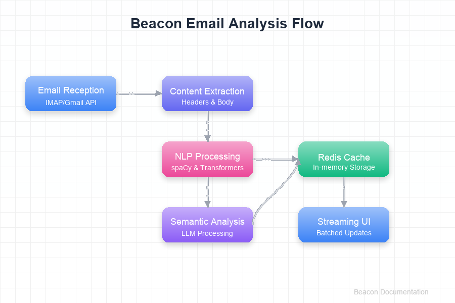

Introduction
============

Beacon is an intelligent email processing application designed to help users manage their email overload through AI-powered analysis and prioritization.

Overview
--------

In today's digital workplace, email overload is a significant challenge for professionals. Beacon addresses this problem by providing:

* **Intelligent Email Analysis**: Automatically extracts key information from emails
* **Priority-Based Organization**: Identifies and highlights important emails
* **Action Item Extraction**: Finds tasks and requests hidden in email content
* **Memory-Efficient Processing**: Handles large volumes of emails with optimized resource usage

The application combines traditional Natural Language Processing (NLP) techniques with advanced Large Language Models (LLMs) to provide a comprehensive understanding of email content.

   The Beacon email analysis flow from raw email to actionable insights

System Requirements
-------------------

* **Python**: 3.8 or higher
* **OS Support**: Linux, macOS, Windows
* **Memory**: 2GB minimum (4GB recommended)
* **Storage**: 500MB for application + database

Getting Started
---------------

To get started with Beacon:

1. Clone the repository
2. Install dependencies using ``pip install -r requirements.txt``
3. Configure your email provider credentials
4. Run the application

For comprehensive installation and configuration instructions, see the project README file.

Target Audience
---------------

Beacon is designed for:

* Professionals dealing with high email volume
* Teams needing to coordinate via email
* Personal users wanting to bring order to their inbox

Architecture Overview
---------------------

Beacon follows a modular architecture with the following key components:

1. **Email Clients**: Connect to email providers (Gmail, IMAP)
2. **Email Analyzers**: Process email content using NLP and LLM techniques
3. **Processing Pipeline**: Orchestrates the analysis workflow
4. **Web Interface**: Provides user access to email insights

Each component is designed to be maintainable, testable, and optimized for performance. 